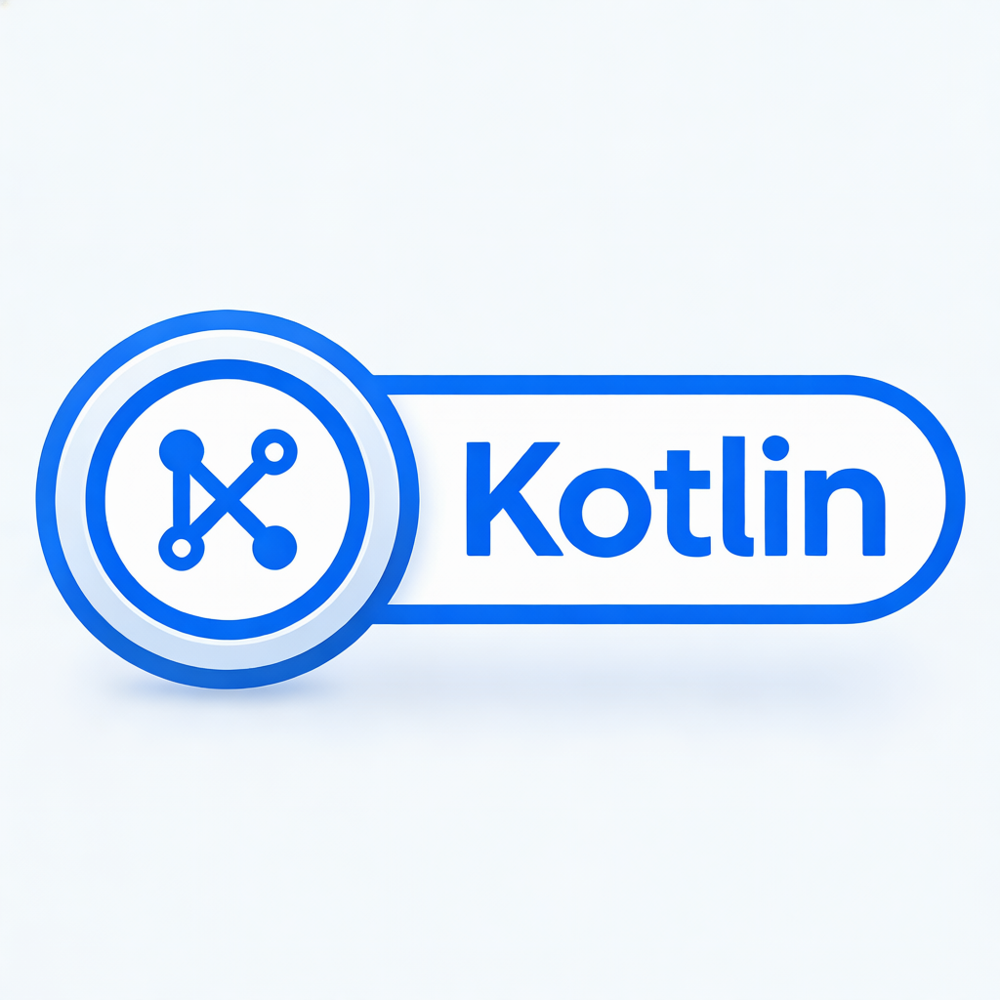

# Kotlin 调试器

<p align="center">
  
</p>

<p align="center">
  <strong>一个独立的 Kotlin/JVM 程序调试器</strong>
</p>

<p align="center">
  <a href="README.md">English</a> •
  <a href="#功能特性">功能特性</a> •
  <a href="#安装">安装</a> •
  <a href="#快速开始">快速开始</a> •
  <a href="#vscode-扩展">VSCode 扩展</a>
</p>

---

## 功能特性

- 🔍 **独立调试器** - 无需 IntelliJ IDEA 即可运行
- 🎯 **断点管理** - 设置、启用、禁用断点，支持条件断点
- 📚 **堆栈帧导航** - 查看和导航调用堆栈
- 🔎 **变量检查** - 检查局部变量和对象属性
- 🧵 **线程管理** - 在线程间切换
- 💡 **表达式求值** - 在断点处求值表达式
- 🔌 **DAP 协议支持** - 与 VSCode 和其他 DAP 兼容编辑器集成
- ⚡ **Kotlin 特性支持** - 内联函数、Lambda、数据类支持

## 系统要求

- JDK 17 或更高版本
- Gradle 8.x（从源码构建时需要）
- Node.js 18+（VSCode 扩展开发时需要）

## 安装

### 方式一：下载预构建版本

从 [GitHub Releases](https://github.com/schizobulia/kt-debugger/releases) 下载最新版本：

```bash
# 下载并解压
wget https://github.com/schizobulia/kt-debugger/releases/latest/download/kotlin-debugger-all.jar

# 运行调试器
java -jar kotlin-debugger-all.jar
```

### 方式二：从源码构建

```bash
# 克隆仓库
git clone https://github.com/schizobulia/kt-debugger.git
cd kt-debugger

# 构建调试器
bash scripts/build.sh

# JAR 文件位于: build/libs/kotlin-debugger-1.0-SNAPSHOT-all.jar
```

### 方式三：安装 VSCode 扩展

参见下方 [VSCode 扩展](#vscode-扩展) 部分。

## 快速开始

### 1. 使用调试选项启动 Kotlin 程序

```bash
# 基本调试模式（程序等待调试器连接）
java -agentlib:jdwp=transport=dt_socket,server=y,suspend=y,address=5005 -jar your-app.jar

# Gradle 项目
./gradlew run --debug-jvm
```

### 2. 连接调试器

**使用命令行:**
```bash
java -jar kotlin-debugger-1.0-SNAPSHOT-all.jar

# 在调试器控制台中:
(kdb) attach localhost:5005
(kdb) break Main.kt:10
(kdb) continue
```

**使用 VSCode:**
1. 安装 Kotlin Debug 扩展
2. 创建 `.vscode/launch.json`:
```json
{
  "version": "0.2.0",
  "configurations": [
    {
      "type": "kotlin",
      "request": "attach",
      "name": "连接到 Kotlin",
      "host": "localhost",
      "port": 5005,
      "sourcePaths": ["${workspaceFolder}/src/main/kotlin"]
    }
  ]
}
```
3. 按 `F5` 开始调试

## 命令参考

### 会话管理
| 命令 | 别名 | 描述 |
|------|------|------|
| `attach <host>:<port>` | - | 连接到远程 JVM |
| `run <class> [-cp path]` | `r` | 启动程序调试 |
| `quit` | `q` | 退出调试器 |
| `help` | `h`, `?` | 显示帮助 |
| `status` | - | 显示会话状态 |

### 断点管理
| 命令 | 别名 | 描述 |
|------|------|------|
| `break <file>:<line>` | `b` | 设置断点 |
| `break <file>:<line> if <cond>` | - | 设置条件断点 |
| `delete <id>` | `d` | 删除断点 |
| `list` | `l` | 列出所有断点 |
| `enable <id>` | - | 启用断点 |
| `disable <id>` | - | 禁用断点 |

### 执行控制
| 命令 | 别名 | 描述 |
|------|------|------|
| `continue` | `c` | 继续执行 |
| `step` | `s` | 单步进入 |
| `next` | `n` | 单步跳过 |
| `finish` | `f` | 单步跳出 |

### 堆栈与变量
| 命令 | 别名 | 描述 |
|------|------|------|
| `backtrace` | `bt`, `where` | 显示调用堆栈 |
| `frame <n>` | `fr` | 切换到第 n 帧 |
| `up` / `down` | - | 导航帧 |
| `locals` | - | 显示局部变量 |
| `print <expr>` | `p` | 打印表达式值 |

### 线程管理
| 命令 | 别名 | 描述 |
|------|------|------|
| `threads` | - | 列出所有线程 |
| `thread <id>` | `t` | 切换到指定线程 |

## 使用文档

| 文档 | 说明 |
|------|------|
| [CLI 使用指南](docs/CLI_GUIDE.md) | 命令行调试器完整参考：所有命令、调试流程和示例 |
| [VS Code 插件使用指南](docs/VSCODE_GUIDE.md) | VS Code 扩展完整指南：启动/附加模式、功能特性和配置说明 |

## VSCode 扩展

Kotlin Debug VSCode 扩展提供图形化的调试体验。

### 安装

**从 VSCode 市场安装:**
1. 打开 VSCode
2. 按 `Ctrl+Shift+X`（Mac 上是 `Cmd+Shift+X`）
3. 搜索 "Kotlin Debug"
4. 点击安装

**从 VSIX 文件安装:**
```bash
# 构建扩展
bash scripts/vscode-ext.sh build

# 安装到 VSCode
bash scripts/vscode-ext.sh install
```

### 功能

- 点击代码行号左侧设置断点
- 在变量面板查看变量
- 导航调用堆栈
- 在调试控制台求值表达式
- 使用 F10/F11 单步执行

详细使用说明请查看 [VSCode 扩展 README](vscode-kotlin-debug/README.md)。

## 项目结构

```
kt-debug/
├── src/main/kotlin/          # 调试器核心源代码
├── src/test/kotlin/          # 单元测试
├── vscode-kotlin-debug/      # VSCode 扩展
├── scripts/
│   ├── build.sh              # 主构建脚本
│   └── vscode-ext.sh         # VSCode 扩展构建脚本
├── docs/                     # 文档
├── release/                  # 发布产物
└── test-program/             # 测试程序
```

## 开发

### 构建

```bash
# 完整构建（包含测试）
bash scripts/build.sh

# 跳过测试
bash scripts/build.sh -s

# 构建 VSCode 扩展
bash scripts/vscode-ext.sh build
```

### 运行测试

```bash
./gradlew test
```

### 贡献代码

1. Fork 仓库
2. 创建功能分支
3. 进行修改
4. 运行测试
5. 提交 Pull Request

## 文档

- [设计文档](docs/DESIGN.md) - 架构和设计决策
- [快速参考](docs/QUICKREF.md) - 命令快速参考
- [教程](docs/TUTORIAL.md) - 分步教程
- [DAP 集成](docs/DAP_INTEGRATION_PLAN.md) - DAP 协议实现

## 许可证

MIT 许可证 - 详见 [LICENSE](LICENSE) 文件。

## 致谢

- [IntelliJ Community](https://github.com/JetBrains/intellij-community) - 参考实现
- [java-debug](https://github.com/microsoft/java-debug) - DAP 协议参考
- [Kotlin](https://github.com/JetBrains/kotlin) - Kotlin 编译器

---

<p align="center">
  用 ❤️ 为 Kotlin 开发者打造
</p>
